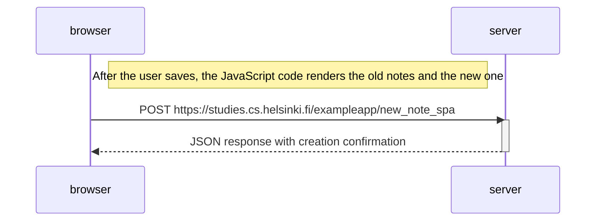

```mermaid
sequenceDiagram
    participant browser
    participant server

    Note right of browser: After the user saves, the JavaScript code renders the old notes and the new one

    browser->>server: POST https://studies.cs.helsinki.fi/exampleapp/new_note_spa
    activate server
    server-->>browser: JSON response with creation confirmation
    deactivate server
```
